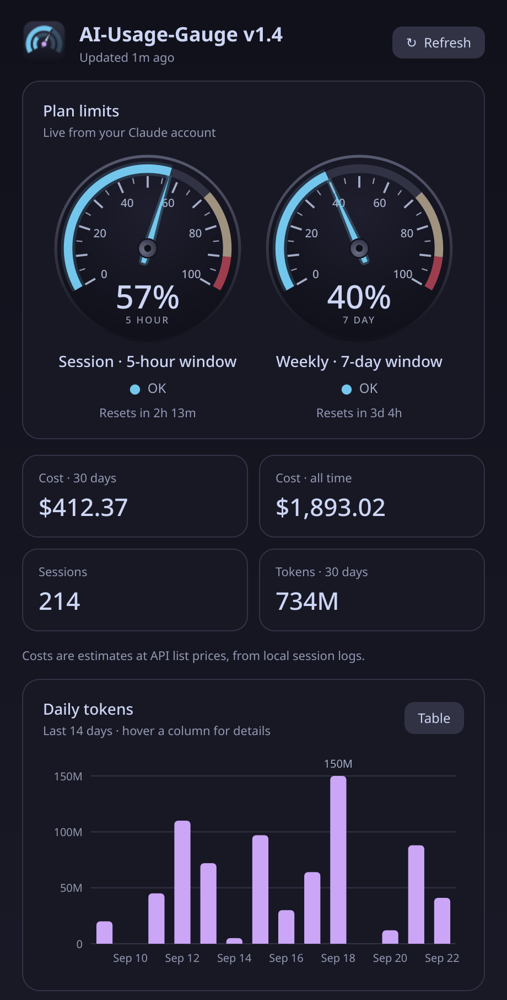

# AI-Usage-Gauge

A small Linux tray app and dashboard that shows how much of your Claude Code
plan you've used, as speedometer gauges.

> **Unofficial.** Not made by, affiliated with, or endorsed by Anthropic.
> Claude and Claude Code are Anthropic's trademarks; they're named here only to
> say what this app works with.
>
> **A hand-updated snapshot.** This repo is a copy of the version I use day to
> day, updated by hand when I get to it. It may lag behind, and there's no
> release schedule.



- **Plan limits**, live from your Claude account: the 5-hour session and weekly
  limits as speedometer gauges, with reset countdowns. The dial's redline
  marks where the status turns High (70 %) and Near limit (90 %). Any other
  limits, and extra pay-as-you-go usage if you have it turned on, appear as
  linear gauges with the same zones. Status is always written out (OK / High /
  Near limit), not shown by colour alone.
- **History**, from Claude Code's local session logs: estimated cost for the
  last 30 days and all time, session count, tokens per day for the last 14
  days (chart, or a table), and cost by model and by project.
- **Tray icon**: a small gauge. The outer arc is the session, the inner arc the
  week, and the needle points at the session. Hover for the numbers; click to
  open the dashboard. Closing the window keeps it in the tray. Quit from the
  tray menu.

## Requirements

- Linux with a system tray (KDE Plasma, most others; GNOME needs the
  AppIndicator extension).
- Python 3.10+ and PyQt6. No other packages.
- Claude Code, logged in with a Claude account (`claude` → `/login`). The app
  reads that login; it has no login of its own.
- On Wayland, XWayland (almost always present). See the note at the top of
  `claude_usage.py`.

## Install and run

```sh
git clone https://github.com/ShiroFoxbrained/AI-Usage-Gauge.git
cd AI-Usage-Gauge
./install.sh               # adds "AI-Usage-Gauge" to your app menu
./install.sh --autostart   # ...and starts it in the tray at login
```

Or run it directly: `python3 claude_usage.py` (window) or
`python3 claude_usage.py --tray` (tray only). Only one copy runs at a time;
launching it again just brings up the window.

## Good to know

- **Where the numbers come from.** Plan limits come from
  `https://api.anthropic.com/api/oauth/usage`. Claude Code uses the same
  endpoint, but it is **undocumented**, so it may change or stop working
  without notice. The app checks it at most every 5 minutes; faster than that,
  the endpoint returns "rate limited".
- **Your login is only read, never changed.** The app uses the login Claude
  Code keeps in `~/.claude/.credentials.json`, read-only. It never refreshes or
  rewrites it, so it can't interfere with Claude Code. When that login
  expires, the gauges say so until you next use Claude Code, which renews it.
  The token is only ever sent to Anthropic.
- **Costs are estimates.** They are calculated at public API list prices from
  the token counts in `~/.claude/projects/**/*.jsonl`. They are not your bill:
  a subscription plan doesn't charge per token. Models not in the price table
  are estimated at Sonnet prices and flagged in the list.
- **Nothing leaves your machine** except the usage check. A copy of the last
  usage reply is cached in `~/.cache/claude-usage/`.

## Tests

`python3 test_claude_usage.py` runs 28 checks. Everything is fake: a local
stand-in server, a dummy login file and made-up logs. It never touches your
real login or calls Anthropic.

## Files

| File | What it is |
|---|---|
| `claude_usage.py` | the app (tray + dashboard) |
| `claude_usage_core.py` | data: usage fetch, log scan, price table |
| `test_claude_usage.py` | self-check (fakes only) |
| `install.sh` | creates the menu entry / autostart entry |
| `icon.png` | app icon |

## License

MIT. See [LICENSE](LICENSE).
